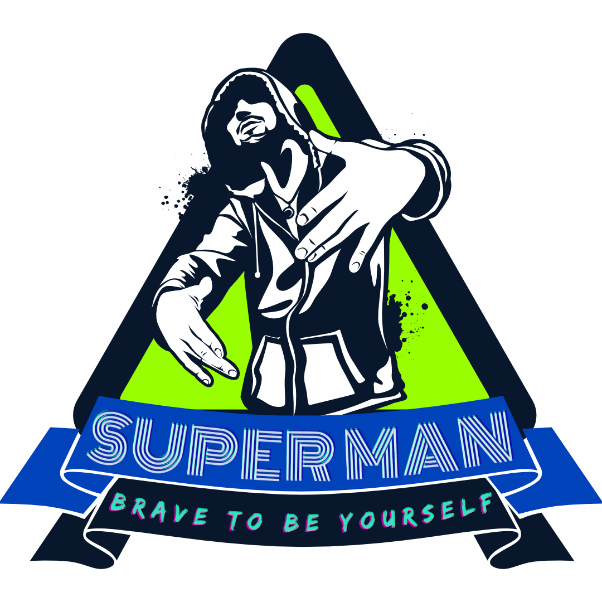
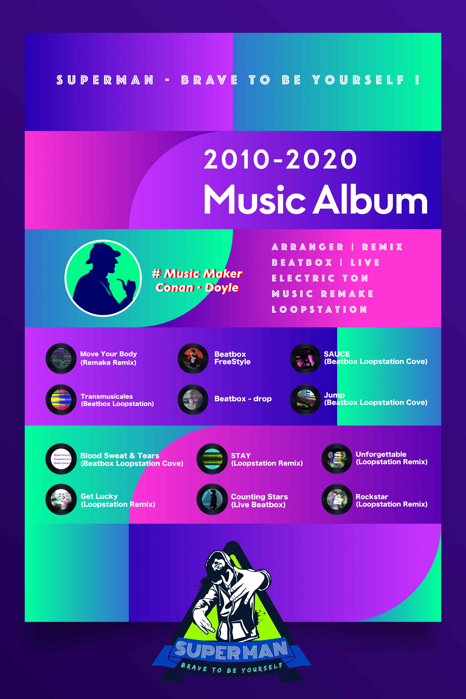

# Moving All Night

 

> Hey Guys, We Are Doing An Interesting Activity, "Moving All Night", We Will Gather Your Favorite Music Melody, Relax Your Vision, Let The Music Show Your Charm, We Open Source The Project On The Github Platform, Hope You Will Enjoy It.

 

# Music Melody Remix List
## Music Style
- [ ] 1. European and American Electronics
  - 1.1 Ofenbach - Be Mine (Stylezz & Denis Agamirov Radio Edit)
  - 1.2 If Only You (Dub Mix)

- [ ] 2. European and American Hip Hop
  - xxxx

- [ ] 3. European and American Rock
  - xxxx

- [ ] 4. Vocal BeatBox
  - xxxx

- [ ] 5. XXXXX
  - xxxx

 
<h4>2010 - 2020  Music Album</h4>

 

## 💡 How to contribute to this open source document💡

1. You can share your favorite music type or music playlist through issues;
2. We will jointly create a distributed mixing project and continue to create new vitality for your favorite music;
3. Share and release the growth of mixing with millions of creators, and impress the world with works;

## License Open Source Agreement
[General Public License Version 2.0](./LICENSE)

---------

