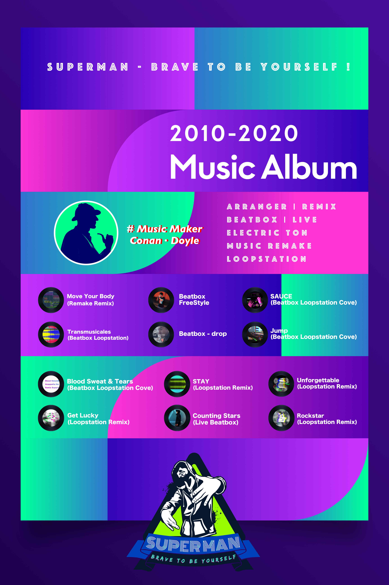

# 整夜舞动

 

> 嘿, 伙计们, 我们正在做一个有趣的活动, "整夜舞动", 我们将汇聚你所喜爱的音乐旋律制作一首属于你的音乐, 让我们放松视觉, 让音乐展现出你的魅力, 我们在Github代码托管平台上此开源项目, 希望你会喜欢它;

 

# 音乐旋律混音列表
## 音乐风格
- [ ] 1. 欧美电子
  - 1.1 Ofenbach - Be Mine (Stylezz & Denis Agamirov Radio Edit)
  - 1.2 If Only You (Dub Mix)
  - 1.3 Tired - (Gavin / Alan Walker Remix)
  - 1.4 Shape Of You (Ramazan Cicek Remix)
  - 1.5 U Are the One - Mari Ferrari
  - 1.6 Us (Original Mix)
  - 1.7 Closer (DJ Criswell Remix)
  - 1.8 Dogs (Original Version) - HVOB
  - 1.9 So Bad - VINNE / SoFLY
  - 2.0 Stranger (Original Mix) - Suprafive / Nesco
  - 2.1 Movement - Club 8
  - 2.2 It's Over - Maki Flow / Jød
  - 2.3 Solo（Lucian Dai HOUSE REMIX）

- [ ] 2. 欧美嘻哈
  - xxxx

- [ ] 3. 欧美摇滚
  - xxxx

- [ ] 4. 人声节奏口技
  - xxxx

- [ ] 5. 韩国电子音乐
  - xxxx

- [ ] 6. 中国电子音乐
  - xxxx

- [ ] 7. XXXXX
  - xxxx

 
<h4>2010 - 2020 音乐专辑</h4>

 

## 💡如何对该开源文档进行贡献💡

1. 可通过issues分享你喜欢的音乐类型或音乐歌单;
2. 我们将共同创建分布式混音项目, 继续为你喜欢的音乐创造新的活力;
3. 与百万创作人一起分享与发布混音成长, 用作品打动世界 ;

## License 开源协议
[General Public License Version 2.0](./LICENSE)

---------
