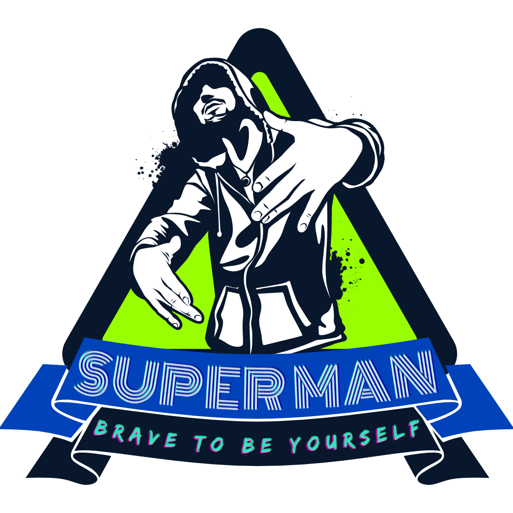

# Moving-All-Night

 

> 嘿, 大家好, 我们正在做一个有趣的活动, "整夜移动", 我们将汇聚你所喜爱的音乐旋律制作一首属于你的音乐, 让我们放松视觉，让音乐展现出你的魅力, 我们在Github代码托管平台上此开源项目, 希望你会喜欢它;

 

# 音乐旋律混音列表
## 音乐风格
- [ ] 1. 欧美电子
  - 1.1 Ofenbach - Be Mine (Stylezz & Denis Agamirov Radio Edit)
  - 1.2 If Only You (Dub Mix)

- [ ] 2. 欧美嘻哈
  - xxxx

- [ ] 4. 欧美摇滚
  - xxxx

- [ ] 4. 节奏口技
  - xxxx

- [ ] 5. XXXXX
  - xxxx

 
<h4>2010 - 2020 音乐专辑</h4>

 

## 💡如何对该开源文档进行贡献💡

1. 可通过issues分享你喜欢的音乐类型或音乐歌单;
2. 我们将共同创建分布式混音项目, 继续为你喜欢的音乐创造新的活力;
3. 与百万创作人一起分享与发布混音成长, 用作品打动世界 ;

## License 开源协议
[General Public License Version 2.0](./LICENSE)

---------
